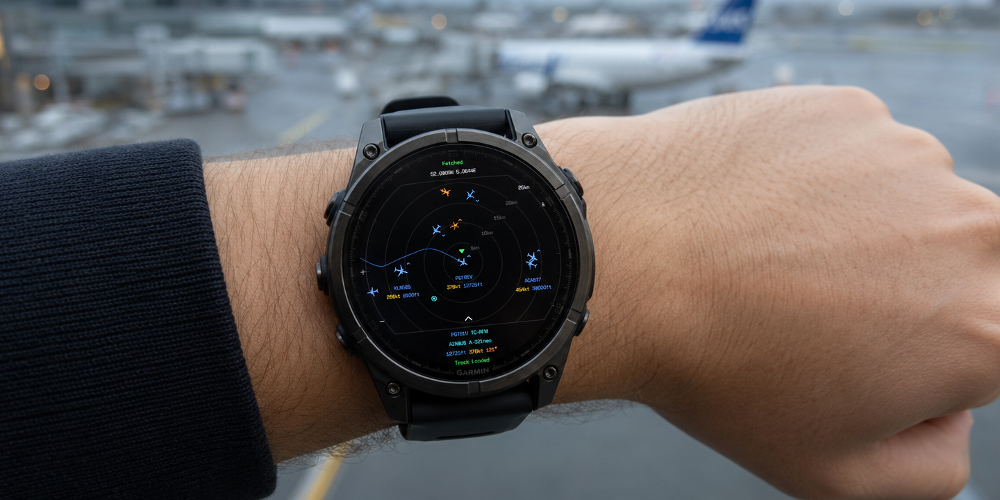
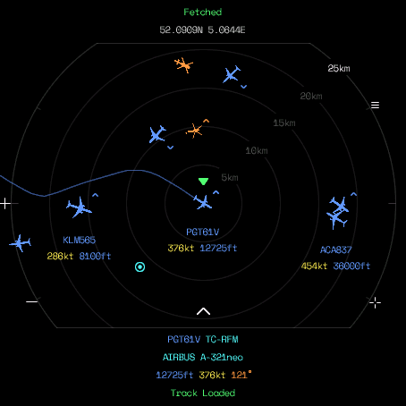
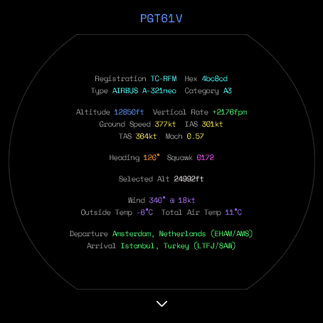

# Flight Radar

A live ADS-B flight radar for Garmin watches, showing every aircraft around you plotted in real time on a radar-style display centered on your GPS position, with a tap for full flight detail.

---

## Features

- Live ADS-B aircraft positions plotted in real time on a radar-style circular display, centered on your GPS position
- **4 zoom levels** (5 / 10 / 25 / 50 km) with an adaptive poll interval, closer zoom polls faster, wider zoom polls slower
- **84 aircraft silhouette icons** (from the tar1090 icon set), matched by exact aircraft type where possible and rotated to true heading
- Color-coded by category at a glance: light aircraft, heavy jets, high-speed/military types, and helicopters each get their own color
- **Tap to select** any aircraft for a live historical flight track, a compact detail panel, and climb/descend chevrons
- **Swipe up** on a selected aircraft for a full-screen detail view: registration, type, category, altitude, vertical rate, ground/indicated/true airspeed, Mach, heading, squawk, autopilot-selected altitude/heading, wind, outside/total air temperature, and departure/arrival airports
- Emergency squawk (7500 / 7600 / 7700) warning badge, drawn ahead of everything else
- Range rings, compass ticks, and a lat/lon grid overlay, all independently toggleable
- Ground-vehicle and fixed-obstacle (towers, masts, tethered balloons) filtering, grounded/stale-position dimming, military filtering
- Battery Saver mode (widens the poll interval) and Single Color Mode (uniform aircraft color, no category coding)
- Metric/imperial unit toggle throughout
- Pan by dragging, recenter/deselect/exit via a single button

---

## Layout

### Radar view

- **Top**: fetch status (`Live` / `Fetching...` / `No Signal` / `Too Busy`) and your current coordinates
- Range rings sit at round-number distances; the outer boundary ring is labeled with the current zoom radius
- Your position is a green triangle; an edge arrow points toward it instead if you've panned it out of view
- Aircraft are drawn as rotated silhouette icons tinted by category, with an optional callsign/speed/altitude label
- A selected aircraft gets a green reticle above it, its historical track drawn behind it, and a compact detail panel along the bottom
- Corner glyphs hint what Up / Down / Menu / Esc do at a glance (toggleable)

### Full detail view

Swipe up on the compact panel (or tap it) for everything the compact panel leaves out: registration, hex code, type, category, altitude, vertical rate, ground/indicated/true airspeed, Mach, heading, squawk, autopilot-selected altitude/heading, wind, outside/total air temperature, and departure/arrival airports resolved from the flight's callsign.

---

## Controls

| Input | Action |
| --- | --- |
| Up | Zoom in |
| Down | Zoom out |
| Enter / Menu | Open Settings |
| Esc | Recenter (if panned) → deselect (if an aircraft is selected) → exit |
| Tap an aircraft | Select it: track, compact panel, chevrons |
| Tap empty space | Deselect, keep the current view |
| Tap the compact panel | Open full detail |
| Drag | Pan the map |
| Swipe up _(aircraft selected)_ | Open full detail |
| Swipe down / Esc _(full detail open)_ | Close |
| Drag / Up / Down _(full detail open)_ | Scroll |

---

## Settings

Settings are grouped into four submenus, reached via the on-device menu (Enter/Menu button).

### Aircraft Labels

| Setting | Description |
| --- | --- |
| Show Labels | Master toggle for all aircraft labels |
| Callsign | Show the flight callsign under each aircraft |
| Speed | Show ground speed |
| Altitude | Show altitude (or `GND` while on the ground) |

### Display

| Setting | Description |
| --- | --- |
| Range Rings | Distance rings and compass ticks |
| Grid Lines | Lat/lon grid overlay |
| Button Hints | Corner glyphs showing what Up / Down / Menu / Esc do |
| Metric Units | km/h, meters, m/min instead of kt/ft/fpm |
| Battery Saver | Triples the poll interval at every zoom level |

### Filters

| Setting | Description |
| --- | --- |
| Show Ground Vehicles | Airport service/emergency vehicles _(off by default)_ |
| Hide Grounded Planes | Hide aircraft currently on the ground |
| Hide Obstacles | Hide fixed obstacles: towers, masts, tethered balloons _(on by default)_ |
| Hide Military | Hide aircraft flagged as military |

### Aircraft

| Setting | Description |
| --- | --- |
| Show Track | Draw the selected aircraft's historical flight path |
| Climb/Descend Arrows | Vertical-rate chevrons above/below climbing/descending aircraft |
| Dim Grounded Aircraft | Dim aircraft currently on the ground |
| Dim Stale Aircraft | Dim aircraft whose position hasn't updated recently |
| Single Color Mode | Draw every aircraft in the default color, ignoring category |

---

## Aircraft Icons & Colors

84 aircraft silhouettes drawn from the tar1090 icon set, matched to the aircraft's exact reported type (e.g. Boeing 738, Airbus A320, F-16) where possible, falling back to a broad ADS-B category shape otherwise. Icons rotate to the aircraft's true heading, except balloons and the fixed-tower obstacle icon, which have no meaningful heading.

| Color | Meaning |
| --- | --- |
| White | Default |
| Yellow | Light aircraft |
| Blue | Heavy aircraft |
| Purple | High-speed aircraft |
| Orange | Helicopter |
| Magenta | Military _(any type)_ |
| Green | Currently selected |
| Red | Emergency squawk _(7500 / 7600 / 7700)_ |

---

## Data Sources

| Source | Used for |
| --- | --- |
| [airplanes.live](https://airplanes.live) | Live aircraft positions within your zoom radius, polled continuously while the app is open, never while the screen is off |
| [OpenSky Network](https://opensky-network.org) | Historical flight track for the selected aircraft, fetched once on selection, then grown live |
| VRS standing data (`adsb.lol`) | Scheduled departure/arrival route for the selected aircraft's callsign |
| [airport-data.com](https://airport-data.com) | City/country/IATA lookup for the resolved departure/arrival airports |

All lookups are free and require no account. Route and airport lookups only fire when the full detail view is opened, never during regular polling.

---

## Devices

Currently built for a single device:

- Garmin fēnix 8 47mm / 51mm / tactix 8 / quatix 8 (`fenix847mm`)
